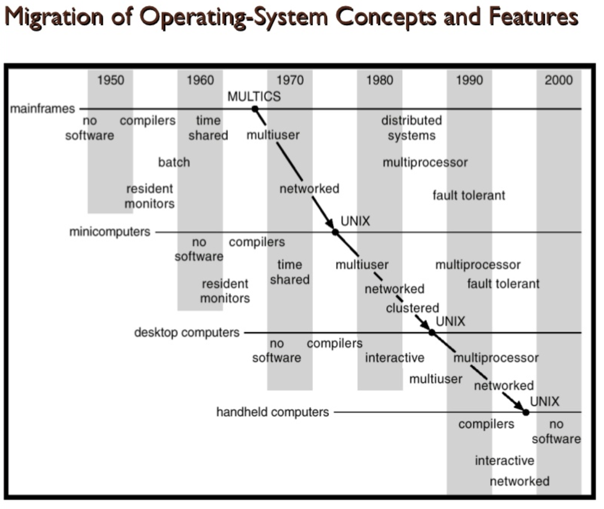

# OS
- OS란 무엇일까?
  - 어플리케이션에게 실행 환경을 제공해주는 System Software.
  - 어플리케이션과 하드웨어의 중간에 있는 소프트웨어이다.
  - 추상화된 기능을 유저에게 제공한다.
  - 자원을 관리하고 안전성을 보장한다.
  - Illusion creator.

# Why we study OS

- 기술적
  컴퓨터 시스템의 가장 중요한 기술에 해당
  복잡한 하드웨어 시스템 관리
  복잡한 프로그램을 개발, 실행시킴
  컴퓨터 시스템이 돌아가는 원리를 이해할 수 있음
- 사업적
  비즈니스 마켓을 이끔
  생태계 형성에 굉장히 중요(구글: 안드로이드, 애플: IOS)
  여러 애플리케이션, 사용자들이 OS에 종속됨

# History
- 운영체제가 만들어지기 이전에는 컴퓨터가 굉장히 느렸기때문에, 사용자는 사용할 시간을 예약해서 그 시간 동안에만 사용해야했다.
- 프로그램은 빨리 끝날수도, 늦게 끝날 수도 있기 때문에, 이런 방법은 컴퓨터를 효율적으로 사용할 수 없다.
- 초기 시스템이 너무나 비효율적이라 운영자를 고용하여 사용자의 작업을 대신 실행하였다.
- 그러나 작업의 준비시간이 너무 길고 여러 단계가 너무 복잡하여 운영자의 기능을 프로그램으로 대치하게 되었는데 이것이 초기의 운영체제이고, 이를 상주모니터(Resident Monitor)라고 한다.

### Evolution of OS
- 시기를 셋으로 나눌 수 있음
1. 50년대 초반 - 60년대 후반 (사람, 모니터)
	1. Human Operator
		- 컴퓨터가 굉장히 비쌌던 시기
		- 사람이 직접 컴퓨터를 조작: 사람이 OS의 역할 수행
		- 세팅에 굉장히 많은 시간이 걸림
	2. Resident Monitor(상주 모니터)
		- OS의 시초
		- 여러 개의 프로그램을 순차적으로 실행시킬 수 있도록 관리(batch process)
	3. Multiprogrammed Batch Monitor
		- 여러 프로그램의 작업 순서를 설정
	4. Spooling
		- 계산과 입/출력을 동시에 수행
2. 60년대 후반 - 90년대 후반 (최신 OS 컨셉): UNIX, 마이크로프로세서의 등장
	1. 멀티태스킹
		- 여러 프로그램이 같은 시간에 실행되도록 함(시간을 쪼개 순차적으로 수행)
		- 유저와의 상호작용: 마우스, 키보드 등을 이용
		- 네트워크의 사용
		- 서로 다른 유저들이 같은 컴퓨터를 같은 시간에 사용 가능
	2. 인터넷
		- 알파넷에서 유래
		- 네트워크를 통해 세계를 하나로 묶게 됨
3. 90년대 후반 - 현재 (모바일, 클라우드 등)
	1. 모바일
		- PDA vs Celluler phone
		- 첫 PDA는 1984년 개발
		- 특징: 터치 스크린, 무선 연결, 배터리 이용
		- PDA OS: Windows CE, Palm OS 등
		- 현재 대세는 모바일 폰: IOS, 안드로이드
	2. 클라우드
	3. 멀티코어
		- 더 많은 코어를 넣는 방식
		- 클락수를 높이는 방식이 한계에 봉착하면서 이를 해결하기 위해 나타남

- OS의 

